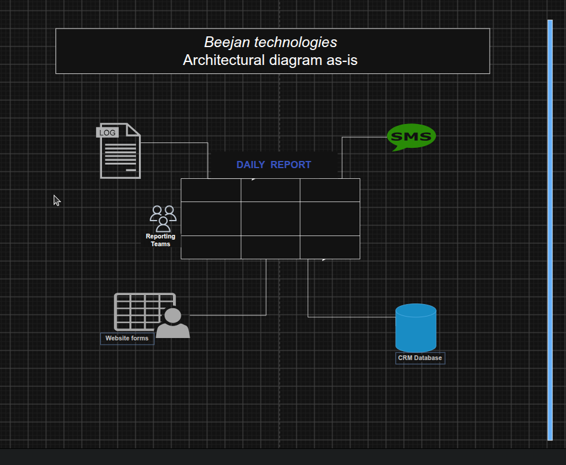
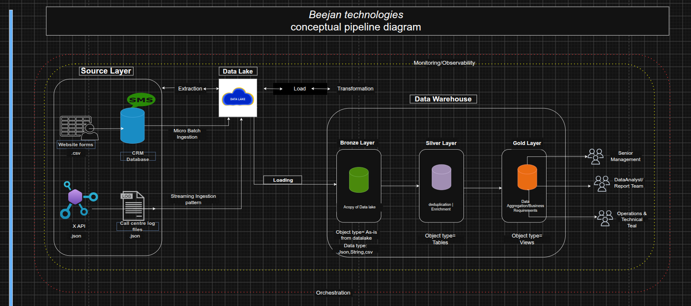

## INTRODUCTION / PROBLEM STATEMENNT
Beejan Technologies is a telecommunications company that receives thousands of customer complaints daily through multiple channels including Twitter (X), SMS, Website Forms, and Call Center Logs. These complaints range from network connectivity issues and service outages to billing disputes and poor customer support experiences.

Currently, customer complaints are spread across different systems and departments. Teams have to manually gather and combine the data before preparing reports, which takes time and often leads to different departments reporting different numbers.This makes it difficult for management to get a clear picture of what customers are experiencing.
Because reporting takes so long, important issues may go unnoticed for days or even weeks. As a result, the company struggles to respond quickly to customer concerns and make timely decisions. To solve this, Beejan Technologies needs a central system that brings all complaint data together and provides reliable insights for both operational teams and management.

## Assumptions

The following assumptions were made to guide the proposed solution design:

#### Business Assumptions
* Beejan Technologies is a small-to-medium-sized telecommunications company.
* Beejan does not require ML or predictions to be done downstream
* Executive management requires **daily** reports to monitor customer complaint trends and service performance.
* Operations teams require dashboards refreshed **hourly** to identify and respond to high-priority issues.
* The organization seeks a cost-effective solution that can scale as complaint volumes grow.
* 
#### Data Assumptions
* SMS and Website Form submissions are stored within the company's CRM database.
* Twitter and Call Center Logs contain complaints that require faster visibility due to their operational impact.

## Design Thinking

The proposed solution is designed to transform fragmented customer complaints into actionable business insights through a centralized and automated data pipeline.

* Customer complaints originate from multiple sources including Twitter (X), Call Center Logs, SMS channels, and Website Forms. Collecting data from all channels ensures a complete view of customer concerns and service performance.
* Because complaint sources generate data at different frequencies, a **hybrid ingestion** strategy is adopted.
Twitter (X) and Call Center Logs are ingested in **near real-time** to support rapid identification of service disruptions and urgent customer issues.
SMS and Website Form submissions stored within the **CRM database** are processed using **scheduled batch loads.**
* The raw data is initially stored in a **Data Lake** to accomodate the different formats the data were generated in and to preserve source records for future reprocessing requirements.
* Processed data is then loaded into a **Data Warehouse** following a Medallion Architecture:
  * Bronze Layer – Raw complaint data
  * Silver Layer – Cleaned, standardized, and categorized data
  * Gold Layer – Business-ready datasets optimized for reporting and analytics
* Processing activities include data cleansing, validation, deduplication, and enrichment.
* To support reporting and trend analysis, complaints are categorized into:
  * Network Issues
  * Billing & Payments
  * Customer Support
* A unique customer identifier is also maintained to ensure complaints submitted through different channels can be linked to the same customer where possible.
* The Gold Layer serves as the trusted source for dashboards and reports.Executive Management receives **daily reports** highlighting complaint trends, service performance, and customer satisfaction indicators while Operations Teams access dashboards refreshed **hourly** to monitor urgent issues and emerging service disruptions.
* Pipeline execution is automated through scheduled workflows. Monitoring and alerting mechanisms are implemented to detect failures, missing data and data quality issues.
* Version control, automated testing, and deployment practices are incorporated to support ongoing maintenance and future enhancements while reducing operational risk.

## Beejan Current Architecture versus Proposed Architecture

## Challenges/ Unknown
1. Customers may not adhere to the designated complaint channels for specific issues.
2. Customer identifiers may not be consistently available across all systems.
3. Real-time processing requirements are not explicitly defined.

## Conclusion 
This solution provides Beejan Technologies with a centralized and scalable approach to managing customer complaints, enabling faster response times, improved reporting accuracy, and data-driven decision-making.
